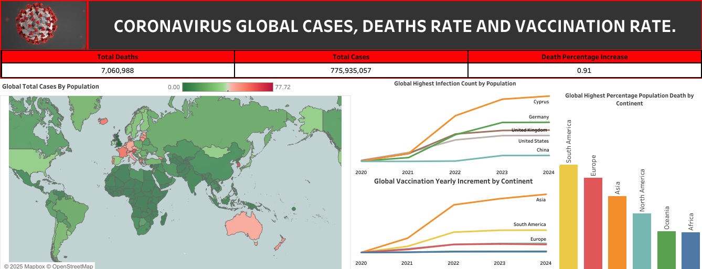

# MY PORTFOLIO
<!--Section 1: Introduce yourself -->

## ABOUT ME

I am Okuu Justin Chidozie, a data analyst passionate about transforming complex data into actionable insights. With a strong foundation in tools like Microsoft Excel, SQL Server, Tableau, and R, I specialize in data wrangling, visualization, and storytelling to drive informed decision-making.

My proficiency includes advanced Excel functions such as PivotTables, VLOOKUP/XLOOKUP, and INDEX/MATCH for efficient data sorting and filtering. I use SQL for powerful data manipulation, including Common Table Expressions (CTEs) and window functions to handle complex queries and perform advanced analytics. I have experience creating dynamic dashboards and reports that clearly communicate key findings to both technical and non-technical stakeholders.

I am committed to continuous learning and am currently improving my skills in Python to further expand my data science toolkit. My goal is to collaborate with global teams and clients, contributing to impactful, data-driven projects that maximize business efficiency and value.

If you're seeking a detail-oriented, analytical, and dependable data analyst with a passion for precision and innovation, let’s connect and explore how I can contribute to your team’s success.
  

<!--Section 2: List 3-4 key projects-->
## MY PROJECTS 

### VISIT MY GITHUB ACCOUNT TO VIEW ALL MY PROJECTS  

*[VISIT MY GITHUB ACCOUNT](https://github.com/okuujustin)*

*Here is a glimpse of some of the projects I have been working on.*

**1.  How I cleaned a healthcare dirty dataset to an analysis-ready dataset using PowerQuery .**

Cleaning a dataset is one of the things I enjoyed doing as an analyst because it confirms that analysis can be performed without glitches. So, the essence of this project is to clean this dataset and get it ready for analysis, and create a detailed report thereafter.

[Read More from my GitHub Account](https://github.com/okuujustin/Data_Cleaning_Using_Excel_and_PowerQuery)

**2.  How I save myself from unnecessary spending.**

I decided to tell a story about my finances last year as a data analyst.
One of my decisions last year was to keep a record of all my cash flow. I tried many times and failed. I decided to learn and grow through the process. Today, I am happy that I have become conscious about putting down all my financial activities, no matter how small. With this, I have saved myself from illicit and unnecessary spending.

[Read More from my GitHub Account](https://github.com/okuujustin/myfinancial_statement_analysis_Sept-Dec2024/edit/main/README.md)

**3.  Analyzing the Global Coronavirus case rate, deaths rate, and vaccination rate.**

Coronavirus was one of the pandemics that shook the world. Millions of lives were lost. 
However, the advent and use of COVID-19 vaccines helped arrest this pandemic to the point it is now.
This project shows the rate of infection increase globally, the death rate, and also the intervention of vaccines.

[Read More from my GitHub Account](https://github.com/okuujustin/SQL-EDA-on-Coronavirus-Deathrate-and-Vaccinationimpact)

## CONTACT DETAILS

*Let’s connect and see how we can make a difference together!*
<table>
  <tbody>
    <tr>
      <td>📧</td>
      <td><a href="mailto:chidozieokuu@gmail.com">chidozieokuu@gmail.com</a></td>
    </tr>
    <tr>
      <td>📞</td>
      <td>(234) 8034155411, (234) 8115406665 </td>
    </tr>
    <tr>
      <td>📍</td>
      <td>Abuja, Nigeria</td>
    </tr>
    <tr>
      <td>⬇️</td>
      <td><a href="okuujustin.cv.pdf">Download my CV</a></td>
    </tr>
    <tr>
      <td>🌐</td>
      <td><a href="https://www.linkedin.com/in/justinokuu/">The things I do daily on LinkedIn</a></td>
    </tr>
    <tr>
      <td>📺</td>
      <td><a href="https://www.youtube.com/channel/UCOL_IFYbJo-j-P3UC_8cnSA?sub_confirmation=1">Watch my tutorials on YouTube</a></td>
    </tr>
  </tbody>
</table>

   

