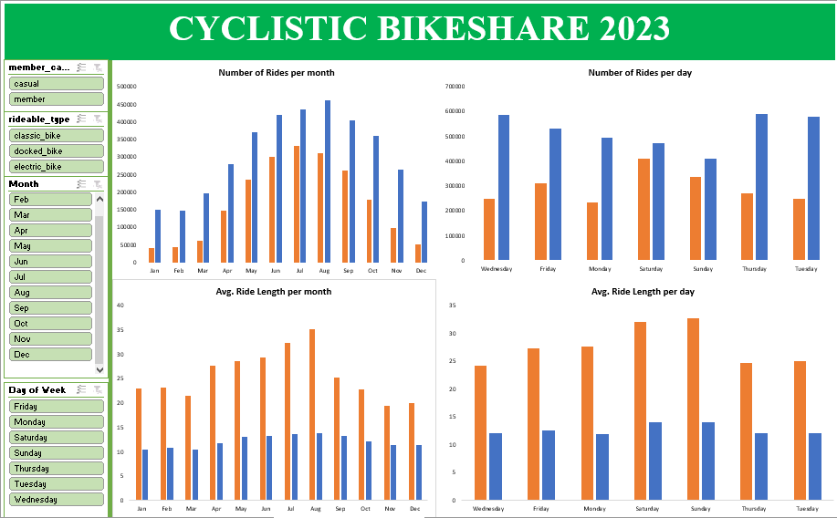

# MY PORTFOLIO
<!--Section 1: Introduce yourself -->
## ABOUT ME
Hello there
  I am Okuu Justin, a data analyst.
  I am well-equipped to work with companies in various areas, such as data sorting and filtering, using pivot tables to summarise data, employing Vlookup/Xlookup and Match/Index to 
 gather  data from different worksheets, conduct data wrangling and manipulations using SQL Server, and leverage innovative ideas and technologies to maximize efficiency and value.
  I love to build dashboards, reports, and tell stories with data visualizations using Excel, Tableau, and R Markdown.
  I am passionate about leveraging industry best practices and innovative technologies, I am eager to connect with global recruiters and clients to contribute to impactful projects and   
  drive continuous improvement.
  
  👀 I’m interested in working on various projects to help companies and businesses make informed, data-driven decisions.
 🌱 I’m currently improving my skills in Python.

  If you are looking for a data analyst who pays attention to details, has an analytical mindset, and a good work ethic, and delivers on time with precision and accuracy, then you have found me.
  Let's connect to work together. 

I showcase projects I have done using data analytics tools like SQL, Tableau, and Excel. 

<!--Section 2: List 3-4 key projects-->
## MY PROJECTS 

### VISIT MY GITHUB ACCOUNT TO VIEW ALL MY PROJECTS  

*[VISIT MY GITHUB ACCOUNT](https://github.com/okuujustin)*

*Here is a glimpse of some of the projects I have been working on.*

**1.  Analyzing the Global Coronavirus case rate, deaths rate, and vaccination rate.**

Coronavirus was one of the pandemics that shook the world. Millions of lives were lost. 
However, the advent and use of COVID-19 vaccines helped arrest this pandemic to the point it is now.
This project shows the rate of infection increase globally, the death rate, and also the intervention of vaccines.

[Read More from my GitHub Account](https://github.com/okuujustin/SQL-EDA-on-Coronavirus-Deathrate-and-Vaccinationimpact)

**2.  Analyzing how Annual Members, Casual Riders Cyclistic Bikeshare Company use Bikes Differently in 2023.**

Cyclistic Bikeshare Company wants to convert its casual riders to annual members to boost revenue.
They intend to spend less on advertising and promotion and focus more on casual riders.
This project will help them decide if this plan will be profitable for them in the coming year.

[Read More from my GitHub Account](https://github.com/okuujustin/How-Annual_members-and-Casual_riders-use-Cyclistics-Differently)

## CONTACT DETAILS

*Let’s connect and see how we can make a difference together!*
<table>
  <tbody>
    <tr>
      <td>📧</td>
      <td><a href="mailto:chidozieokuu@gmail.com">chidozieokuu@gmail.com</a></td>
    </tr>
    <tr>
      <td>📞</td>
      <td>(234) 8034155411, (234) 8115406665 </td>
    </tr>
    <tr>
      <td>📍</td>
      <td>Abuja, Nigeria</td>
    </tr>
    <tr>
      <td>⬇️</td>
      <td><a href="okuujustin.cv.pdf">Download my CV</a></td>
    </tr>
    <tr>
      <td>🌐</td>
      <td><a href="https://www.linkedin.com/in/justinokuu/">The things I do daily on LinkedIn</a></td>
    </tr>
    <tr>
      <td>📺</td>
      <td><a href="https://www.youtube.com/channel/UCOL_IFYbJo-j-P3UC_8cnSA?sub_confirmation=1">Watch my tutorials on YouTube</a></td>
    </tr>
  </tbody>
</table>

   

