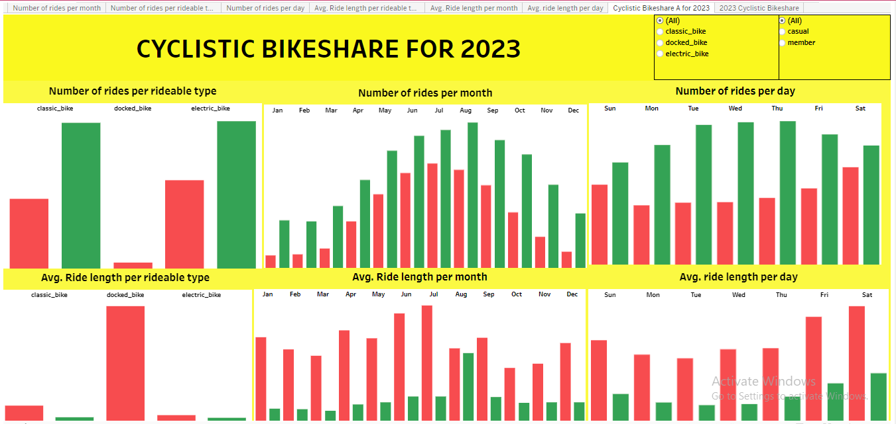

# MY PORTFOLIO
<!--Section 1: Introduce yourself -->
## ABOUT ME

Hello! I am Okuu Justin, an entry-level data analyst.
I am well-equipped to work with companies in various areas, such as data sorting and filtering, Using pivot tables to summarise data, Employing Vloopup/Xlookup and Match/Index to gather data from different worksheets, conducting data wrangling and manipulations using SQL(MySQL, SQL Server), and leveraging innovative ideas and technologies to maximize efficiency and value.

I love to build dashboards, and reports and tell stories with data visualizations using Excel, tableau, and R Markdown.

I am passionate about leveraging industry best practices and innovative technologies, I am eager to connect with global recruiters and clients to contribute to impactful projects and drive continuous improvement.

I showcase projects I have done using data analytics tools like SQL, R Programming, Tableau, and Excel skills. 

<!--Section 2: List 3-4 key projects-->
## MY PORTFOLIO 

*A glimpse of some of the projects I've been working on.*

**Analyzing the Global Coronavirus case rate, deaths rate, and rate of vaccination.**

Coronavirus was one of the pandemics that shook the world. Millions of lives were lost. 
However, the advent and use of COVID-19 vaccines helped arrest this pandemic to the point it is now.
This project shows the rate of infection increase globally, the death rate, and also the intervention of vaccines.

[Read More](https://github.com/okuujustin/SQL-EDA-on-Coronavirus-Deathrate-and-Vaccinationimpact)

**Analyzing how Annual Members, Casual riders Cyclistic Bikeshare Company use Bikes Differently in 2023.**

Cyclistic Bikeshare Company wants to convert their casual riders to annual member in order to boost revenue.
They intend not to spend so much on advert and promotion, so they want to focus on casual rider.
This project helpls the to decide if this plan will profitable for them in the coming year.

[Read More](https://github.com/okuujustin/How-Annualmembers-and-Casualriders-use-Cyclistics-Differently)

## CONTACT DETAILS

*Let’s connect and see how we can make a difference together!*
<table>
  <tbody>
    <tr>
      <td>📧</td>
      <td><a href="mailto:chidozieokuu@gmail.com">chidozieokuu@gmail.com</a></td>
    </tr>
    <tr>
      <td>📞</td>
      <td>(234) 8034155411, (234) 8115406665 </td>
    </tr>
    <tr>
      <td>📍</td>
      <td>Abuja, Nigeria</td>
    </tr>
    <tr>
      <td>⬇️</td>
      <td><a href="https://etuk123456.github.io/portfolio1/docs/Profile.pdf">Download my CV</a></td>
    </tr>
    <tr>
      <td>🌐</td>
      <td><a href="https://www.linkedin.com/in/justinokuu/">The things I do daily on LinkedIn</a></td>
    </tr>
    <tr>
      <td>📺</td>
      <td><a href="https://www.youtube.com/@techwalldatahub">Watch my tutorials on YouTube</a></td>
    </tr>
  </tbody>
</table>

   

